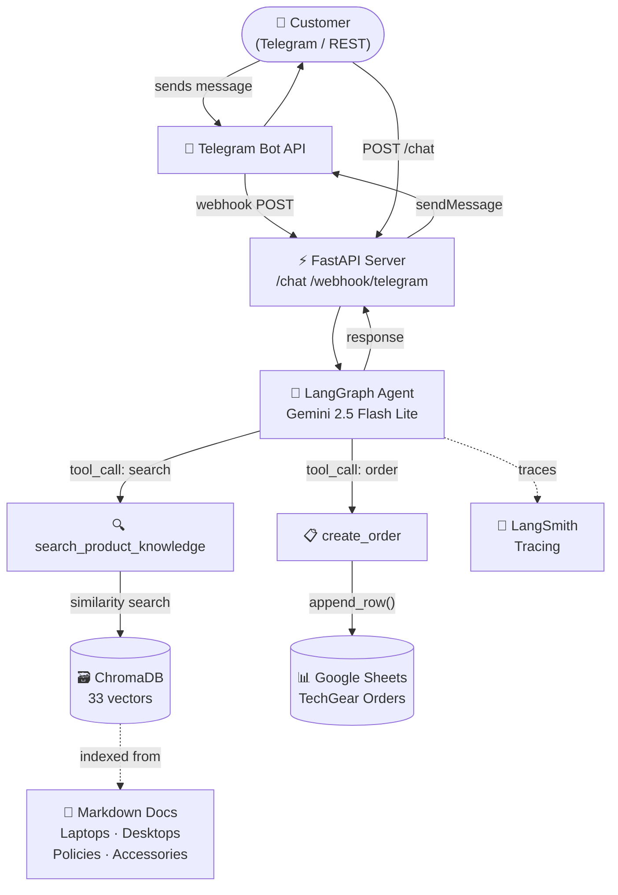

# TechGear Agent


> An AI-powered customer support agent for a Vietnamese tech store — provides product consultation via RAG, captures orders into Google Sheets, and communicates through Telegram Bot.

---

## Features

| # | Feature | Description |
|---|---------|-------------|
| 1 | **Agentic RAG** | Automatically retrieves laptop, PC, component, and policy information from ChromaDB (33 vectors) |
| 2 | **Order Tool** | Collects customer name, phone number, and product, then writes directly to Google Sheets |
| 3 | **Telegram Bot** | Natural conversation via Telegram Webhook — Vietnamese language support |
| 4 | **REST API** | `/chat` endpoint for direct testing without Telegram |
| 5 | **Session Memory** | LangGraph MemorySaver — maintains conversation history per `session_id` |
| 6 | **LangSmith Tracing** | All traces stored in LangSmith for debugging |
| 7 | **Evaluation** | DeepEval: Answer Relevancy 100%, Faithfulness 100%, Contextual Recall 80% |
| 8 | **Docker** | `docker compose up` — runs immediately, no extra configuration needed |

---

## Evaluation Results (15 RAG test cases)

Evaluated using `gemini-2.5-flash-lite` as the judge model:

| Metric | Score | Threshold | Result |
|--------|-------|-----------|--------|
| Answer Relevancy | **100%** | 70% | ✅ PASS |
| Faithfulness | **100%** | 70% | ✅ PASS |
| Contextual Recall | **80%** | 70% | ✅ PASS |

```bash
python scripts/run_evaluation.py --category RAG
```

---

## Unit Tests (31 tests)

```bash
pytest tests/ -v
# 31 passed in 1.80s
```

| Test file | Tests | Coverage |
|-----------|-------|----------|
| `test_agent.py` | 15 | Phone validation, Order tool, RAG tool |
| `test_api.py` | 8 | Health check, Chat endpoint, Telegram webhook |
| `test_rag.py` | 8 | Chunker, Retriever, Document loading |

---

## Architecture



---

## Project Structure

```
techgear-agent/
├── data/raw/                     # Mock knowledge base (Markdown)
│   ├── laptops/                  # MacBook Air/Pro, Dell XPS, ASUS ROG, ThinkPad
│   ├── desktops/                 # Intel/AMD CPUs, RTX GPUs, RAM, SSD, Motherboards
│   ├── policies/                 # Warranty and return policies
│   └── accessories/              # Monitors, keyboards, mice, hubs, headsets
├── src/
│   ├── config.py                 # Pydantic Settings (reads from .env)
│   ├── rag/
│   │   ├── chunker.py            # RecursiveCharacterTextSplitter (chunk=1000)
│   │   ├── embedder.py           # sentence-transformers / Google embeddings
│   │   └── retriever.py          # ChromaDB similarity search (top_k=5, threshold=0.3)
│   ├── agent/
│   │   ├── agent.py              # LangGraph StateGraph + MemorySaver
│   │   ├── prompts.py            # System prompt
│   │   └── tools/
│   │       ├── rag_tool.py       # search_product_knowledge
│   │       └── order_tool.py     # create_order (validate phone + write to Sheets)
│   ├── integrations/
│   │   ├── google_sheets.py      # gspread append_order()
│   │   └── telegram_bot.py       # sendMessage + retry plain-text on parse error
│   └── api/
│       ├── main.py               # FastAPI app + lifespan (auto set webhook)
│       ├── schemas.py            # Pydantic request/response models
│       └── routers/
│           ├── chat.py           # POST /chat
│           └── webhook.py        # POST/GET/DELETE /webhook/telegram
├── scripts/
│   ├── ingest_data.py            # One-time ChromaDB ingestion
│   ├── run_evaluation.py         # DeepEval runner (saves JSON report)
│   └── test_connections.py       # Verify Sheets + Telegram connectivity
├── evaluation/
│   ├── test_cases.json           # 30 test cases: RAG (15) · Order (10) · Edge (5)
│   └── reports/                  # eval_report_YYYYMMDD_HHMMSS.json
├── tests/
│   ├── test_agent.py
│   ├── test_api.py
│   └── test_rag.py
├── docker/Dockerfile
├── docker-compose.yml
├── pyproject.toml
├── requirements.txt              # Production dependencies
├── requirements-dev.txt          # Dev + evaluation dependencies
└── .env.example
```

---

## Getting Started

### Prerequisites

- Python 3.10+
- [Google Gemini API key](https://aistudio.google.com/apikey) (free)
- Telegram Bot token (create via [@BotFather](https://t.me/BotFather))
- Google Cloud Service Account (for Google Sheets access)
- [ngrok](https://ngrok.com/download) (for local Telegram webhook development)

---

### 1. Clone & Install

```bash
git clone https://github.com/manhsontran/TechGear-Agent.git
cd TechGear-Agent

python -m venv .venv
# Windows:
.venv\Scripts\activate
# macOS/Linux:
source .venv/bin/activate

pip install -r requirements.txt
```

---

### 2. Configure `.env`

```bash
cp .env.example .env
```

Fill in the required values:

```env
# LLM
GEMINI_API_KEY=AIza...

# Telegram
TELEGRAM_BOT_TOKEN=123456789:AAF...
WEBHOOK_BASE_URL=https://xxxx.ngrok-free.app

# Google Sheets
GOOGLE_SERVICE_ACCOUNT_JSON={"type":"service_account","project_id":"..."}
GOOGLE_SHEET_ID=1BxiMVs0XRA5nFM...

# Embeddings (offline, Vietnamese-friendly)
EMBEDDING_PROVIDER=sentence-transformers
EMBEDDING_MODEL=paraphrase-multilingual-mpnet-base-v2

# LLM Model
LLM_MODEL=gemini-2.5-flash-lite

# LangSmith (optional)
LANGSMITH_TRACING=true
LANGSMITH_API_KEY=lsv2_pt_...
LANGSMITH_PROJECT=techgear
```

---

### 3. Ingest Data into ChromaDB

```bash
python scripts/ingest_data.py --reset
# ✅ Ingestion complete! ChromaDB collection now has 33 vectors.
```

---

### 4. Start the Server

```bash
uvicorn src.api.main:app --reload --port 8080
# API docs: http://localhost:8080/docs
```

---

### 5. Quick Test via REST

```bash
curl -X POST http://localhost:8080/chat \
  -H "Content-Type: application/json" \
  -d '{"message": "How much is the MacBook Air M3?", "session_id": "test"}'
```

---

## Running with Docker

```bash
cp .env.example .env  # Fill in API keys

# Ingest data (only needed once)
docker compose --profile init up ingest

# Start the API server
docker compose up -d

# View logs
docker compose logs -f api

# Stop
docker compose down
```

---

## Google Sheets Integration

### Step 1 — Create a Service Account

1. Go to [console.cloud.google.com](https://console.cloud.google.com/)
2. **APIs & Services → Enable APIs** → enable **Google Sheets API** + **Google Drive API**
3. **Credentials → Create Credentials → Service Account** → name it → Done
4. Click the service account → **Keys → Add Key → JSON** → download the `.json` file

### Step 2 — Set Up the Google Sheet

1. Create a new Google Spreadsheet at [sheets.google.com](https://sheets.google.com)
2. **Share** the sheet with the service account email (`name@project.iam.gserviceaccount.com`) → role **Editor**
3. Copy the **Sheet ID** from the URL: `.../spreadsheets/d/**{SHEET_ID}**/edit`

### Step 3 — Add to `.env`

```bash
# Convert JSON to a single line
# Windows PowerShell:
(Get-Content service-account.json -Raw) -replace "`r`n","" -replace "`n",""
# macOS/Linux:
cat service-account.json | tr -d '\n'
```

```env
GOOGLE_SERVICE_ACCOUNT_JSON={"type":"service_account", ...}
GOOGLE_SHEET_ID=1BxiMVs0XRA5nFMdKvBdBZjgmUUqptlbs74OgVE2upms
```

### Step 4 — Verify Connection

```bash
python scripts/test_connections.py --sheets
# ✅ Service account JSON valid
# ✅ Sheet opened: 'TechGear Orders'
# ✅ Worksheet ready — headers: Timestamp | Name | Phone | Product | Notes | Status
```

---

## Telegram Webhook Setup

### Step 1 — Create a Bot

1. Chat with [@BotFather](https://t.me/BotFather) → `/newbot`
2. Copy the **Bot Token** → add to `.env`

### Step 2 — Run ngrok

```bash
ngrok config add-authtoken <your-token>   # once only
ngrok http 8080
# Copy URL: https://xxxx.ngrok-free.app
```

Add to `.env`:
```env
WEBHOOK_BASE_URL=https://xxxx.ngrok-free.app
```

> **Note:** The ngrok URL changes on every restart (free plan).  
> After changing the URL, call `POST /webhook/telegram/refresh` to update without restarting the server.

### Step 3 — Start the Server

```bash
uvicorn src.api.main:app --reload --port 8080
# INFO: Telegram webhook set to: https://xxxx.ngrok-free.app/webhook/telegram
```

### Step 4 — Manage Webhook

```bash
# Check status
curl http://localhost:8080/webhook/telegram/info

# Update after ngrok URL change
curl -X POST http://localhost:8080/webhook/telegram/refresh

# Delete webhook (switch to polling)
curl -X DELETE http://localhost:8080/webhook/telegram
```

### Step 5 — Verify All Connections

```bash
python scripts/test_connections.py
# ✅ Google Sheets connected
# ✅ Telegram Bot: @YourBotName
# ✅ Webhook: https://xxxx.ngrok-free.app/webhook/telegram
```

---

## Running Unit Tests

```bash
pytest tests/ -v

# Output:
# tests/test_agent.py  ......... (15 passed)
# tests/test_api.py    ........ (8 passed)
# tests/test_rag.py    ........ (8 passed)
# ========================= 31 passed in 1.80s =========================
```

---

## Evaluation (DeepEval)

```bash
# RAG cases only (15 cases, ~5 min)
python scripts/run_evaluation.py --category RAG

# All 30 cases
python scripts/run_evaluation.py

# Specify output directory
python scripts/run_evaluation.py --output evaluation/reports
```

**Actual results (RAG — 15 test cases):**

```
✨ Answer Relevancy  (gemini-2.5-flash-lite) → 100% pass
✨ Faithfulness      (gemini-2.5-flash-lite) → 100% pass
✨ Contextual Recall (gemini-2.5-flash-lite) →  80% pass
```

Report saved to `evaluation/reports/eval_report_YYYYMMDD_HHMMSS.json`

---

## API Reference

### `POST /chat`

```json
// Request
{ "message": "How much is the RTX 4070?", "session_id": "user_abc" }

// Response
{ "reply": "The NVIDIA GeForce RTX 4070...", "session_id": "user_abc" }
```

### `POST /webhook/telegram`

Receives [Telegram Update](https://core.telegram.org/bots/api#update) objects. Automatically processes and replies via Bot API.

### `GET /health`

```json
{ "status": "ok", "service": "TechGear Agent API" }
```

### `GET /webhook/telegram/info`

Returns the current webhook status from the Telegram API.

### `POST /webhook/telegram/refresh`

Re-registers the webhook using the current `WEBHOOK_BASE_URL` from `.env`.

### `DELETE /webhook/telegram`

Deletes the webhook (bot switches to polling mode).

---

## Tech Stack

| Layer | Technology | Version |
|-------|-----------|---------|
| API Framework | FastAPI + Uvicorn | 0.115.5 |
| Agent Orchestration | LangGraph (StateGraph + MemorySaver) | 0.2.60 |
| LLM | Google Gemini 2.5 Flash Lite | via `langchain-google-genai` |
| Embeddings | sentence-transformers (multilingual) | `paraphrase-multilingual-mpnet-base-v2` |
| Vector DB | ChromaDB (embedded, persistent) | 0.5.23 |
| Telegram | httpx + Bot API | — |
| Google Sheets | gspread + google-auth | — |
| Observability | LangSmith tracing | — |
| Evaluation | DeepEval | 2.3.4 |
| Containerization | Docker + Docker Compose | — |

---

## Roadmap

- [x] Core RAG pipeline (ChromaDB + sentence-transformers)
- [x] Agentic RAG (LangGraph + 2 tools)
- [x] FastAPI REST API
- [x] Google Sheets integration (Order tool)
- [x] Telegram Bot + Webhook
- [x] LangSmith observability
- [x] DeepEval evaluation (31 unit tests, 15 RAG eval cases)
- [x] Docker Compose deployment
- [ ] Zalo OA API integration
- [ ] Admin dashboard (Streamlit)
- [ ] PDF knowledge base upload
- [ ] Cloud deployment (Oracle Cloud / Railway)

---

## License

MIT © 2026 TechGear
