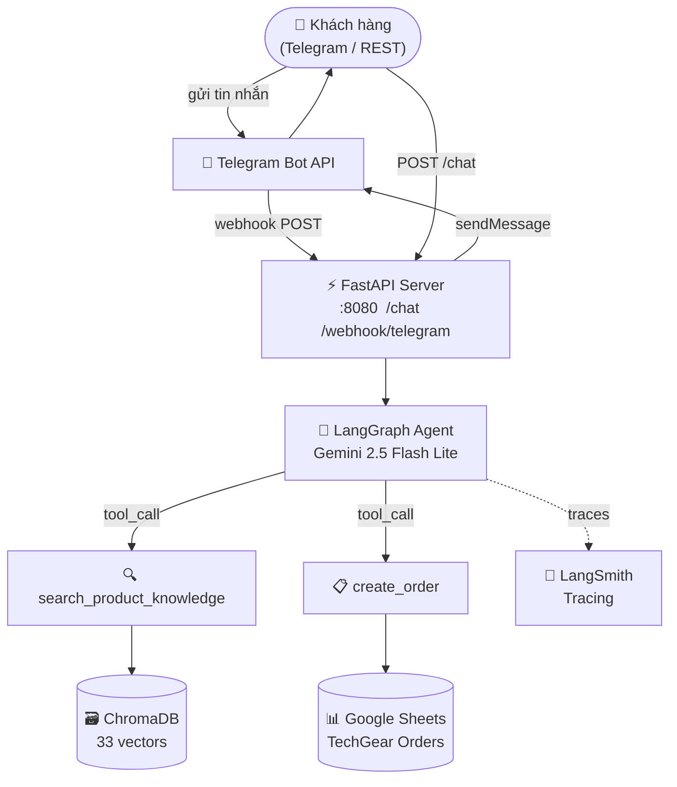
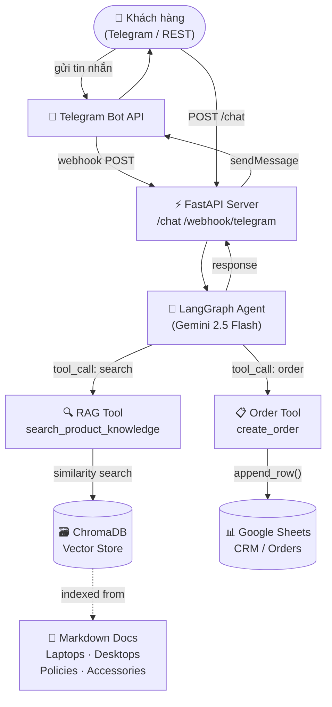

# TechGear Agent


> AI Agent đóng vai nhân viên hỗ trợ cửa hàng thiết bị công nghệ — tư vấn sản phẩm qua RAG, tiếp nhận đơn hàng vào Google Sheets, giao tiếp qua Telegram Bot.

---

## Tính Năng

| # | Tính năng | Mô tả |
|---|-----------|-------|
| 1 | **Agentic RAG** | Tự động tra cứu thông số laptop, PC, linh kiện, chính sách từ ChromaDB (33 vectors) |
| 2 | **Order Tool** | Thu thập Tên + SĐT + Sản phẩm rồi ghi thẳng vào Google Sheets |
| 3 | **Telegram Bot** | Giao tiếp tự nhiên qua Telegram Webhook — hỗ trợ tiếng Việt |
| 4 | **REST API** | Endpoint `/chat` để test trực tiếp không qua Telegram |
| 5 | **Session Memory** | LangGraph MemorySaver — nhớ lịch sử hội thoại per `session_id` |
| 6 | **LangSmith Tracing** | Toàn bộ trace được lưu tại Confident AI / LangSmith để debug |
| 7 | **Evaluation** | DeepEval: Answer Relevancy 100%, Faithfulness 100%, Contextual Recall 80% |
| 8 | **Docker** | `docker compose up` — chạy ngay, không cần cấu hình thêm |

---

## Kết Quả Evaluation (15 RAG test cases)

Chạy với `gemini-2.5-flash-lite` làm judge model:

| Metric | Score | Threshold | Kết quả |
|--------|-------|-----------|---------|
| Answer Relevancy | **100%** | 70% | ✅ PASS |
| Faithfulness | **100%** | 70% | ✅ PASS |
| Contextual Recall | **80%** | 70% | ✅ PASS |

```
python scripts/run_evaluation.py --category RAG
```

---

## Unit Tests (31 tests)

```
pytest tests/ -v
# 31 passed in 1.80s
```

| Test file | Số tests | Nội dung |
|-----------|----------|----------|
| `test_agent.py` | 15 | Phone validation, Order tool, RAG tool |
| `test_api.py` | 8 | Health, Chat endpoint, Telegram webhook |
| `test_rag.py` | 8 | Chunker, Retriever, Document loading |

---

## Kiến Trúc



---

## Cấu Trúc Thư Mục

```
techgear-agent/
├── data/raw/                     # Mock knowledge base (Markdown)
│   ├── laptops/                  # MacBook Air/Pro, Dell XPS, ASUS ROG, ThinkPad
│   ├── desktops/                 # CPU Intel/AMD, GPU RTX, RAM, SSD, Mainboard
│   ├── policies/                 # Bảo hành, đổi trả
│   └── accessories/              # Màn hình, bàn phím, chuột, hub, tai nghe
├── src/
│   ├── config.py                 # Pydantic Settings (đọc từ .env)
│   ├── rag/
│   │   ├── chunker.py            # RecursiveCharacterTextSplitter (chunk=1000)
│   │   ├── embedder.py           # sentence-transformers / Google embeddings
│   │   └── retriever.py          # ChromaDB similarity search (top_k=5, threshold=0.3)
│   ├── agent/
│   │   ├── agent.py              # LangGraph StateGraph + MemorySaver
│   │   ├── prompts.py            # System prompt (Tiếng Việt)
│   │   └── tools/
│   │       ├── rag_tool.py       # search_product_knowledge
│   │       └── order_tool.py     # create_order (validate SĐT + ghi Sheets)
│   ├── integrations/
│   │   ├── google_sheets.py      # gspread append_order()
│   │   └── telegram_bot.py       # sendMessage + retry plain-text on parse error
│   └── api/
│       ├── main.py               # FastAPI app + lifespan (auto set webhook)
│       ├── schemas.py            # Pydantic request/response
│       └── routers/
│           ├── chat.py           # POST /chat
│           └── webhook.py        # POST/GET/DELETE /webhook/telegram
├── scripts/
│   ├── ingest_data.py            # One-time ChromaDB ingestion
│   ├── run_evaluation.py         # DeepEval runner (JSON report)
│   └── test_connections.py       # Verify Sheets + Telegram kết nối
├── evaluation/
│   ├── test_cases.json           # 30 test cases: RAG (15) · Order (10) · Edge (5)
│   └── reports/                  # eval_report_YYYYMMDD_HHMMSS.json
├── tests/
│   ├── test_agent.py
│   ├── test_api.py
│   └── test_rag.py
├── docker/Dockerfile
├── docker-compose.yml
├── pyproject.toml
├── requirements.txt
└── .env.example
```

---

## Hướng Dẫn Cài Đặt

### Yêu Cầu

- Python 3.10+
- [Google Gemini API key](https://aistudio.google.com/apikey) (miễn phí)
- Telegram Bot token (tạo qua [@BotFather](https://t.me/BotFather))
- Google Cloud Service Account (để ghi Google Sheets)
- [ngrok](https://ngrok.com/download) (cho Telegram webhook khi dev local)

---

### 1. Clone & Cài Đặt

```bash
git clone https://github.com/your-username/techgear-agent.git
cd techgear-agent

python -m venv .venv
# Windows:
.venv\Scripts\activate
# macOS/Linux:
source .venv/bin/activate

pip install -r requirements.txt
```

---

### 2. Cấu Hình `.env`

```bash
cp .env.example .env
```

Điền các giá trị bắt buộc:

```env
# LLM
GEMINI_API_KEY=AIza...

# Telegram
TELEGRAM_BOT_TOKEN=123456789:AAF...
WEBHOOK_BASE_URL=https://xxxx.ngrok-free.app

# Google Sheets
GOOGLE_SERVICE_ACCOUNT_JSON={"type":"service_account","project_id":"..."}
GOOGLE_SHEET_ID=1BxiMVs0XRA5nFM...

# Embeddings
EMBEDDING_PROVIDER=sentence-transformers
EMBEDDING_MODEL=paraphrase-multilingual-mpnet-base-v2

# LangSmith (optional)
LANGSMITH_TRACING=true
LANGSMITH_API_KEY=lsv2_pt_...
LANGSMITH_PROJECT=techgear
```

---

### 3. Nạp Dữ Liệu vào ChromaDB

```bash
python scripts/ingest_data.py --reset
# ✅ Ingestion complete! ChromaDB collection now has 33 vectors.
```

---

### 4. Khởi Chạy Server

```bash
uvicorn src.api.main:app --reload --port 8080
# API docs: http://localhost:8080/docs
```

---

### 5. Test Nhanh qua REST

```bash
curl -X POST http://localhost:8080/chat \
  -H "Content-Type: application/json" \
  -d '{"message": "MacBook Air M3 giá bao nhiêu?", "session_id": "test"}'
```

---

## Chạy với Docker

```bash
cp .env.example .env  # Điền API keys

# Nạp dữ liệu (chỉ cần làm 1 lần)
docker compose --profile init up ingest

# Khởi động API server
docker compose up -d

# Xem logs
docker compose logs -f api

# Dừng
docker compose down
```

---

## Tích Hợp Google Sheets

### Bước 1 — Tạo Service Account

1. Truy cập [console.cloud.google.com](https://console.cloud.google.com/)
2. **APIs & Services → Enable APIs** → bật **Google Sheets API** + **Google Drive API**
3. **Credentials → Create Credentials → Service Account** → đặt tên → Done
4. Click vào service account → **Keys → Add Key → JSON** → tải file `.json`

### Bước 2 — Chuẩn Bị Google Sheet

1. Tạo Google Spreadsheet mới tại [sheets.google.com](https://sheets.google.com)
2. **Share** sheet với email service account (dạng `name@project.iam.gserviceaccount.com`) → role **Editor**
3. Copy **Sheet ID** từ URL: `.../spreadsheets/d/**{SHEET_ID}**/edit`

### Bước 3 — Điền vào `.env`

```bash
# Chuyển JSON thành 1 dòng
# Windows PowerShell:
(Get-Content service-account.json -Raw) -replace "`r`n","" -replace "`n",""
# macOS/Linux:
cat service-account.json | tr -d '\n'
```

```env
GOOGLE_SERVICE_ACCOUNT_JSON={"type":"service_account", ...}
GOOGLE_SHEET_ID=1BxiMVs0XRA5nFMdKvBdBZjgmUUqptlbs74OgVE2upms
```

### Bước 4 — Kiểm Tra

```bash
python scripts/test_connections.py --sheets
# ✅ Service account JSON valid
# ✅ Sheet opened: 'TechGear Orders'
# ✅ Worksheet ready — headers: Timestamp | Tên KH | SĐT | Sản phẩm | Ghi chú | Trạng thái
```

---

## Cấu Hình Telegram Webhook

### Bước 1 — Tạo Bot

1. Chat với [@BotFather](https://t.me/BotFather) → `/newbot`
2. Copy **Bot Token** → điền vào `.env`

### Bước 2 — Chạy ngrok

```bash
ngrok config add-authtoken <your-token>   # 1 lần duy nhất
ngrok http 8080
# Copy URL: https://xxxx.ngrok-free.app
```

Điền vào `.env`:
```env
WEBHOOK_BASE_URL=https://xxxx.ngrok-free.app
```

> **Lưu ý:** ngrok URL thay đổi mỗi lần restart (bản free).  
> Sau khi đổi URL, gọi `POST /webhook/telegram/refresh` để cập nhật mà không cần restart server.

### Bước 3 — Khởi Động

```bash
uvicorn src.api.main:app --reload --port 8080
# INFO: Telegram webhook set to: https://xxxx.ngrok-free.app/webhook/telegram
```

### Bước 4 — Quản Lý Webhook

```bash
# Xem trạng thái
curl http://localhost:8080/webhook/telegram/info

# Cập nhật sau khi đổi ngrok URL
curl -X POST http://localhost:8080/webhook/telegram/refresh

# Xóa webhook (chuyển sang polling)
curl -X DELETE http://localhost:8080/webhook/telegram
```

### Bước 5 — Kiểm Tra Toàn Bộ

```bash
python scripts/test_connections.py
# ✅ Google Sheets connected
# ✅ Telegram Bot: @YourBotName
# ✅ Webhook: https://xxxx.ngrok-free.app/webhook/telegram
```

---

## Chạy Unit Tests

```bash
pytest tests/ -v

# Kết quả:
# tests/test_agent.py  ......... (15 passed)
# tests/test_api.py    ........ (8 passed)
# tests/test_rag.py    ........ (8 passed)
# ========================= 31 passed in 1.80s =========================
```

---

## Evaluation (DeepEval)

```bash
# Chỉ chạy RAG cases (15 cases, ~5 phút)
python scripts/run_evaluation.py --category RAG

# Chạy toàn bộ 30 cases
python scripts/run_evaluation.py

# Chỉ định thư mục output
python scripts/run_evaluation.py --output evaluation/reports
```

**Kết quả thực tế (RAG — 15 test cases):**

```
✨ Answer Relevancy  (gemini-2.5-flash-lite) → 100% pass
✨ Faithfulness      (gemini-2.5-flash-lite) → 100% pass
✨ Contextual Recall (gemini-2.5-flash-lite) →  80% pass
```

Report được lưu tại `evaluation/reports/eval_report_YYYYMMDD_HHMMSS.json`

---

## API Reference

### `POST /chat`

```json
// Request
{ "message": "RTX 4070 giá bao nhiêu?", "session_id": "user_abc" }

// Response
{ "reply": "NVIDIA GeForce RTX 4070...", "session_id": "user_abc" }
```

### `POST /webhook/telegram`

Nhận [Telegram Update](https://core.telegram.org/bots/api#update) objects. Tự động xử lý và reply qua Bot API.

### `GET /health`

```json
{ "status": "ok", "service": "TechGear Agent API" }
```

### `GET /webhook/telegram/info`

Trả về trạng thái webhook hiện tại từ Telegram API.

### `POST /webhook/telegram/refresh`

Đăng ký lại webhook với `WEBHOOK_BASE_URL` hiện tại trong `.env`.

### `DELETE /webhook/telegram`

Xóa webhook (bot chuyển sang polling mode).

---

## Tech Stack

| Layer | Technology | Version |
|-------|-----------|---------|
| API Framework | FastAPI + Uvicorn | 0.115.5 |
| Agent Orchestration | LangGraph (StateGraph + MemorySaver) | 0.2.60 |
| LLM | Google Gemini 2.5 Flash Lite | via `langchain-google-genai` |
| Embeddings | sentence-transformers (multilingual) | `paraphrase-multilingual-mpnet-base-v2` |
| Vector DB | ChromaDB (embedded, persistent) | 0.5.23 |
| Telegram | httpx + Bot API | — |
| Google Sheets | gspread + google-auth | — |
| Observability | LangSmith tracing | — |
| Evaluation | DeepEval | 2.3.4 |
| Containerization | Docker + Docker Compose | — |

---

## Lộ Trình Phát Triển

- [x] Core RAG pipeline (ChromaDB + sentence-transformers)
- [x] Agentic RAG (LangGraph + 2 tools)
- [x] FastAPI REST API
- [x] Google Sheets integration (Order tool)
- [x] Telegram Bot + Webhook
- [x] LangSmith observability
- [x] DeepEval evaluation (31 unit tests, 15 RAG eval cases)
- [x] Docker Compose deployment
- [ ] Zalo OA API integration
- [ ] Admin dashboard (Streamlit)
- [ ] PDF knowledge base upload
- [ ] Deploy lên Cloud Run / Railway

---

## License

MIT © 2026 TechGear


---

## Kiến Trúc



---

## Cấu Trúc Thư Mục

```
techgear-agent/
├── data/raw/                     # Mock data (Markdown)
│   ├── laptops/                  # MacBook, Dell XPS, ASUS ROG, ThinkPad
│   ├── desktops/                 # CPU Intel/AMD, GPU RTX, RAM, SSD
│   ├── policies/                 # Bảo hành, đổi trả
│   └── accessories/              # Màn hình, bàn phím, chuột, hub
├── src/
│   ├── config.py                 # Pydantic settings (đọc từ .env)
│   ├── rag/                      # chunker · embedder · retriever
│   ├── agent/
│   │   ├── agent.py              # LangGraph StateGraph
│   │   ├── prompts.py            # System prompt
│   │   └── tools/                # rag_tool · order_tool
│   ├── integrations/
│   │   ├── google_sheets.py      # gspread append_order()
│   │   └── telegram_bot.py       # sendMessage · setWebhook
│   └── api/
│       ├── main.py               # FastAPI app + lifespan
│       ├── schemas.py            # Pydantic request/response models
│       └── routers/              # chat · webhook
├── scripts/
│   ├── ingest_data.py            # One-time ChromaDB ingestion
│   └── run_evaluation.py         # DeepEval evaluation runner
├── evaluation/
│   ├── test_cases.json           # 30 test cases (RAG / Order / Edge)
│   └── reports/                  # HTML evaluation reports
├── tests/                        # Unit & integration tests
├── docker/Dockerfile
├── docker-compose.yml
├── .env.example
└── requirements.txt
```

---

## Hướng Dẫn Cài Đặt

### Yêu Cầu

- Python 3.11+
- Docker & Docker Compose (cho deployment)
- Google Gemini API key (miễn phí tại [aistudio.google.com](https://aistudio.google.com/apikey))
- Telegram Bot token (tạo qua [@BotFather](https://t.me/BotFather))
- Google Cloud Service Account với quyền Google Sheets API

### 1. Clone & Cài Đặt

```bash
git clone https://github.com/your-username/techgear-agent.git
cd techgear-agent

python -m venv .venv
# Windows:
.venv\Scripts\activate
# macOS/Linux:
source .venv/bin/activate

pip install -r requirements.txt
```

### 2. Cấu Hình Biến Môi Trường

```bash
cp .env.example .env
# Mở .env và điền các giá trị:
# - GEMINI_API_KEY  (lấy tại https://aistudio.google.com/apikey)
# - TELEGRAM_BOT_TOKEN
# - WEBHOOK_BASE_URL (ngrok URL khi dev local)
# - GOOGLE_SERVICE_ACCOUNT_JSON
# - GOOGLE_SHEET_ID
```

### 3. Nạp Dữ Liệu vào ChromaDB

```bash
python scripts/ingest_data.py --reset
# Output: ✅ Ingestion complete! ChromaDB collection now has N vectors.
```

### 4. Khởi Chạy Server

```bash
uvicorn src.api.main:app --reload --port 8000
# API docs: http://localhost:8000/docs
```

### 5. Test Nhanh qua REST

```bash
curl -X POST http://localhost:8000/chat \
  -H "Content-Type: application/json" \
  -d '{"message": "MacBook Air M3 giá bao nhiêu?", "session_id": "test"}'
```

---

## Chạy với Docker

```bash
# Bước 1: Tạo file .env từ template
cp .env.example .env  # rồi điền API keys

# Bước 2: Nạp dữ liệu (chỉ cần làm 1 lần)
docker compose --profile init up ingest

# Bước 3: Khởi động API server
docker compose up -d

# Kiểm tra logs
docker compose logs -f api

# Dừng server
docker compose down
```

---

## Tích Hợp Google Sheets (Order Tool)

### Bước 1 — Tạo Google Cloud Project & Service Account

1. Truy cập [console.cloud.google.com](https://console.cloud.google.com/)
2. Tạo project mới (hoặc chọn project có sẵn)
3. Vào **APIs & Services → Enable APIs** → bật **Google Sheets API** và **Google Drive API**
4. Vào **APIs & Services → Credentials → Create Credentials → Service Account**
   - Đặt tên (vd: `techgear-agent`)
   - Bỏ qua phần "Grant access" → Done
5. Click vào service account vừa tạo → tab **Keys → Add Key → JSON** → tải file `.json` về máy

### Bước 2 — Chuẩn bị Google Sheet

1. Tạo Google Spreadsheet mới tại [sheets.google.com](https://sheets.google.com)
2. Đặt tên tuỳ ý (vd: `TechGear Orders`)
3. **Share sheet với service account**: click Share → paste email của service account (dạng `techgear-agent@project-id.iam.gserviceaccount.com`) → role **Editor**
4. Copy **Sheet ID** từ URL: `https://docs.google.com/spreadsheets/d/**{SHEET_ID}**/edit`

### Bước 3 — Điền vào `.env`

Chuyển file JSON thành 1 dòng:
```bash
# Windows PowerShell:
(Get-Content service-account.json -Raw) -replace "`r`n","" -replace "`n",""

# macOS/Linux:
cat service-account.json | tr -d '\n'
```

Paste vào `.env`:
```
GOOGLE_SERVICE_ACCOUNT_JSON={"type":"service_account","project_id":"...", ...}
GOOGLE_SHEET_ID=1BxiMVs0XRA5nFMdKvBdBZjgmUUqptlbs74OgVE2upms
```

### Bước 4 — Kiểm tra kết nối

```bash
python scripts/test_connections.py --sheets
# ✅ Service account JSON valid (client_email: techgear-agent@...)
# ✅ Sheet opened: 'TechGear Orders'
# ✅ Worksheet: 'Sheet1' — 1000 rows
```

> Lần đầu agent ghi đơn hàng, header row sẽ tự động được tạo:
> `Timestamp | Tên KH | SĐT | Sản phẩm | Ghi chú | Trạng thái`

---

## Cấu Hình Telegram Webhook (Local Dev)

### Bước 1 — Tạo Telegram Bot

1. Mở Telegram, tìm [@BotFather](https://t.me/BotFather)
2. Gửi `/newbot` → đặt tên bot → nhận **Bot Token** dạng `123456789:AAF...`
3. Điền token vào `.env`:
   ```
   TELEGRAM_BOT_TOKEN=123456789:AAF...
   ```

### Bước 2 — Cài và chạy ngrok

```bash
# Tải tại https://ngrok.com/download, sau đó:
ngrok http 8000
```

Copy URL dạng `https://xxxx.ngrok-free.app` → điền vào `.env`:
```
WEBHOOK_BASE_URL=https://xxxx.ngrok-free.app
```

> ⚠️ ngrok URL thay đổi mỗi lần restart (bản free). Sau mỗi lần đổi URL,
> gọi `POST /webhook/telegram/refresh` để cập nhật mà không cần restart server.

### Bước 3 — Khởi động server

```bash
uvicorn src.api.main:app --reload --port 8000
# Webhook tự đăng ký khi app khởi động
# Log sẽ hiển thị: INFO  Telegram webhook set to: https://xxxx.ngrok-free.app/webhook/telegram
```

### Bước 4 — Kiểm tra webhook

```bash
# Xem trạng thái webhook hiện tại
curl http://localhost:8000/webhook/telegram/info

# Output mong đợi:
# {"ok": true, "result": {"url": "https://xxxx.ngrok-free.app/webhook/telegram", ...}}

# Cập nhật webhook sau khi đổi ngrok URL (không cần restart):
curl -X POST http://localhost:8000/webhook/telegram/refresh
```

### Bước 5 — Kiểm tra toàn bộ connections

```bash
python scripts/test_connections.py
# ✅ Service account JSON valid
# ✅ Sheet opened: 'TechGear Orders'
# ✅ Bot authenticated: @YourBotName
# ✅ Webhook registered: https://xxxx.ngrok-free.app/webhook/telegram
```

### Bước 6 — Test

Mở Telegram → chat với bot → bot reply qua LangGraph agent.

---

## Chạy Tests

```bash
pytest tests/ -v
```

---

## Evaluation (DeepEval)

```bash
# Chạy toàn bộ 30 test cases
python scripts/run_evaluation.py

# Chỉ chạy RAG cases
python scripts/run_evaluation.py --category RAG

# Report được lưu tại evaluation/reports/eval_report_YYYYMMDD_HHMMSS.html
```

**Metrics đánh giá:**

| Metric | Mô tả | Threshold |
|--------|-------|-----------|
| Answer Relevancy | Câu trả lời có đúng trọng tâm không | ≥ 0.7 |
| Faithfulness | AI có bịa thông số ngoài context không | ≥ 0.7 |
| Contextual Recall | Retrieval có lấy đủ thông tin cần thiết không | ≥ 0.7 |

---

## API Reference

### `POST /chat`

```json
// Request
{
  "message": "RTX 4070 giá bao nhiêu?",
  "session_id": "user_abc"
}

// Response
{
  "reply": "NVIDIA GeForce RTX 4070 tại TechGear có giá từ 16.490.000 ₫ (Gigabyte EAGLE OC) đến 17.490.000 ₫ (MSI GAMING X TRIO)...",
  "session_id": "user_abc"
}
```

### `POST /webhook/telegram`

Nhận Telegram Update objects. Tự động xử lý và reply qua Telegram Bot API.

### `GET /health`

```json
{"status": "ok", "service": "TechGear Agent API"}
```

---

## Tech Stack

| Layer | Technology |
|-------|-----------|
| API Framework | FastAPI + Uvicorn |
| Agent Orchestration | LangGraph (StateGraph + MemorySaver) |
| LLM | Google Gemini 2.5 Flash Lite |
| Embeddings | Google text-embedding-004 (hoặc sentence-transformers) |
| Vector DB | ChromaDB (embedded, persistent) |
| Telegram | httpx + Telegram Bot API |
| Google Sheets | gspread + google-auth |
| Evaluation | DeepEval |
| Containerization | Docker + Docker Compose |

---

## Lộ Trình Phát Triển

- [x] Tuần 1: Mock data + Core RAG pipeline
- [x] Tuần 2: Agentic RAG (LangGraph + Tools)
- [x] Tuần 3: FastAPI + Telegram Webhook
- [x] Tuần 4: DeepEval + Docker Compose
- [ ] Tích hợp Zalo OA API
- [ ] Admin dashboard (Streamlit)
- [ ] Hỗ trợ file PDF upload
- [ ] Deploy lên Cloud Run / Railway

---

## License

MIT © 2026 TechGear
